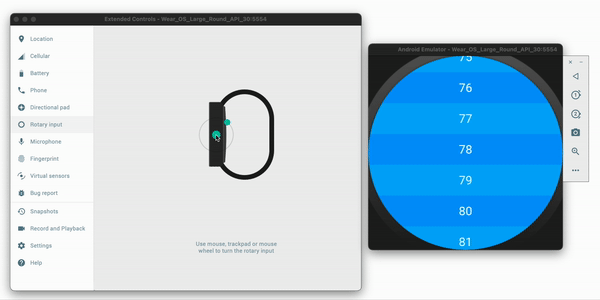

# rotary_list
A plugin that offers a ListView which can be scrolled with the [rotary input](https://developer.android.com/training/wearables/user-input/rotary-input) of Wear OS devices.



*The delay between rotating the rotary input and the list movement, as can be seen in the gif above, is only noticeable on emulators. Not on real devices!*

## Requirements 
To use this plugin, the `minSdkVersion` of your android project has to be at least `18`. The `minSdkVersion` can be found in `./android/app/build.gradle` in the root directory of your flutter project.

## Installation
1. To install this plugin depend on it in your `pubspec.yaml`
    ``` yaml
    dependencies:
      flutter:
        sdk: flutter

      # other plugins ...

      rotary_list:
        git:
          url: git://github.com/sebastianloose/rotary-list.git
          ref: main
    ```
2. Run `flutter pub get` in your terminal

## Usage
Since the RotaryList widgets are subclasses of their corresponding ListView widgets, RotaryList accepts the same arguments as ListView. In addition to these there are the following attributes for the scrolling behavior:

| Attribute | Type | Default |
| --- | --- | --- |
| scrollFactor | int | 100 |
| scrollAnimationDuration | Duration | Duration(milliseconds: 200) |
| scrollCurve | Curve | Curves.fastOutSlowIn |
| reverseScroll | bool | false |


### RotaryList
```dart
RotaryList(
    children: [
        // widgets ...
    ],
),
```
```dart
RotaryList(
    scrollFactor: 120,
    scrollAnimationDuration: const Duration(milliseconds: 500),
    scrollCurve: Curves.fastLinearToSlowEaseIn,
    reverseScroll: true,
    children: [
        // widgets ...
    ],
),
```

### RotaryList.builder
```dart
RotaryList.builder(
    itemBuilder: (_, int i) => Text(i.toString()),
    itemCount: 100,
),
```
```dart
RotaryList.builder(
    scrollFactor: 120,
    scrollAnimationDuration: const Duration(milliseconds: 500),
    scrollCurve: Curves.fastLinearToSlowEaseIn,
    reverseScroll: true,
    itemBuilder: (_, int i) => Text(i.toString()),
    itemCount: 100,
),
```
